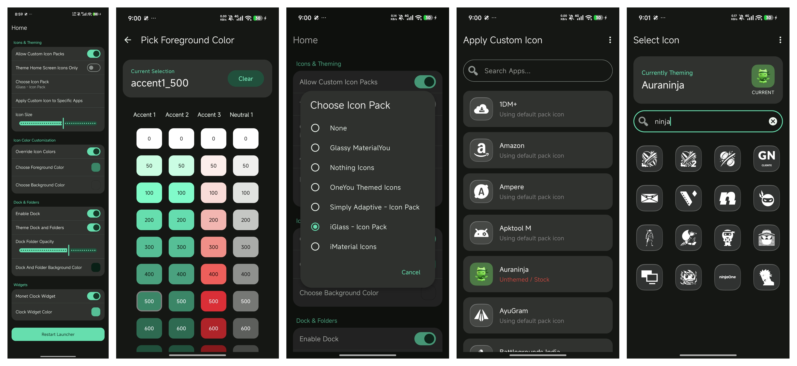

# IconsCustomizer 🎨

An advanced Xposed/LSPosed module designed to bring ultimate icon customization to the HyperOS Launcher. Break free from default icons and apply any custom third-party icon pack directly to your system launcher.

> **⚠️ Developer Note:**
> I originally created this project for my own personal use. Please do not expect immediate updates or quick bug fixes! If you run into issues, feel free to report them on [GitHub Issues](../../issues) or on my Reddit post, and I will try my best to fix them whenever I have free time.

## 📸 Screenshots

  <b>HyperOS with Custom Icon Packs</b> 
  

 

  <b>IconsCustomizer Module Interface</b> 
  

## ✨ Features

* **Universal Icon Pack Support:** Apply almost any standard Android icon pack from the Play Store directly to the stock HyperOS launcher.
* **Per-App Customization:** Change icons on an individual app basis without affecting the rest of your system.
* **Seamless Integration:** Works cleanly with the native launcher without requiring bulky third-party home screen replacements.
* **Dynamic Sizing:** Adjust icon dimensions globally for a perfect fit on your display.

## ⚠️ Prerequisites

Before installing, ensure your device meets the following requirements:
1. **Root Access:** Magisk or KernelSU installed.
2. **Xposed Framework:** LSPosed (Zygisk or Riru version) installed and active.
3. **OS:** HyperOS (Tested on Poco F7 HyperOS 3.0 And 3.1 China Latest Launcher).

## 🚀 Installation

1. Download the latest `.apk` from the [Releases](../../releases) page.
2. Install the APK on your device.
3. Open the **LSPosed Manager** app.
4. Go to the **Modules** tab and enable **IconsCustomizer**.
5. Ensure the **System Launcher** (HyperOS Launcher) is checked in the scope list.
6. **Force Stop Launcher App Or Reboot your device** to apply the hooks.

## 🛠️ How to Use

1. Open the **IconsCustomizer** app from your app drawer.
2. Enable the **Allow Custom Icon Packs** option.
3. Select your desired installed icon pack from the list.
4. If some apps have missing icons in the icon pack, use the **"Apply Custom Icon to Specific Apps"** option and choose an identical icon from the icon pack for that app.
5. Tap the **"Restart Launcher"** button to apply changes immediately.

> **🎨 Note on Monet Theming:**
> If you are using icon packs with Monet theming colors, you will need to use the **ColorBlendr** app to manage your Monet color palette control. You must click the **Restart Launcher** button every time you change your wallpaper or make changes to your Monet color palette to apply those new colors to your icons.
> It is recommended to use **Override Icon Colors** option only with Icon Packs That Support's dynamic Monet Wallpaper based colors.

## 📜 License

This project is licensed under the [MIT License](LICENSE).